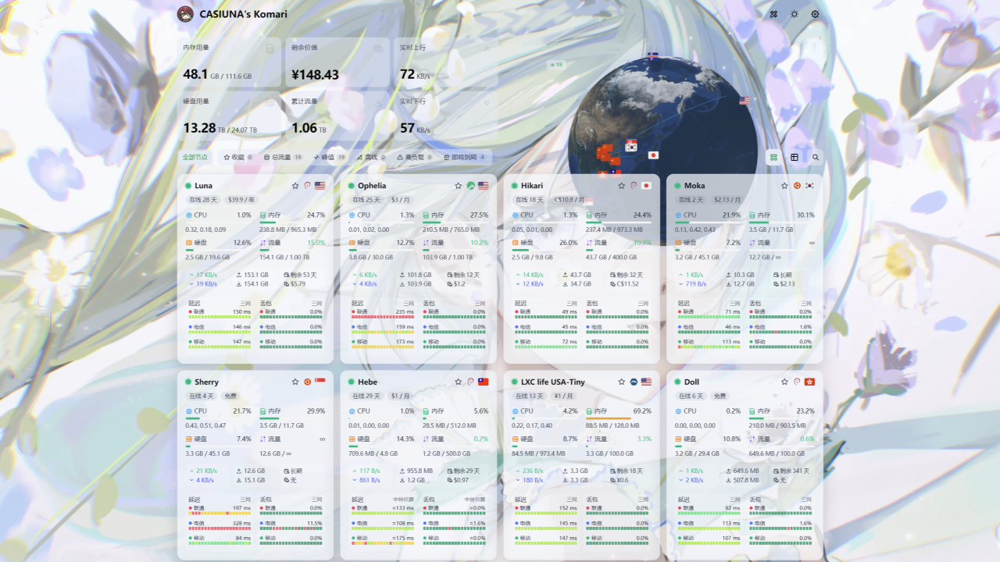

# Glassmorphism Enhanced

Glassmorphism Enhanced 是一个面向 [Komari Monitor](https://github.com/komari-monitor/komari) 的独立维护主题：用毛玻璃界面、三网质量指标、响应式 NodeCard 和可选的 Transit Carrier Ping，帮助你快速判断节点状态与入口路径。

[](CHANGELOG.md)
[](LICENSE)

[下载 Releases](https://github.com/casiuna/Glassmorphism-Enhanced/releases) · [安装](#installation) · [Transit Carrier Ping](#transit-carrier-ping) · [开发](#development)

## Preview



## Features

- **Glassmorphism UI**：毛玻璃卡片、浅色 / 深色 / 北京时间自动模式、动态背景、色觉友好配色与减弱动画。
- **三网延迟与丢包**：分别展示中国联通、电信、移动的 RTT、丢包率和历史色块；同一运营商的多个 Ping Task 会聚合。
- **Transit Carrier Ping**：可选地用“用户 → Relay → Target”的两段数据派生三网估算，明确区分估算值和 direct 探测。
- **多种 NodeCard 尺寸**：`mini`、`compact`、`comfortable`、`large`，并提供适合密集巡检的列表视图。
- **地球与拓扑可视化**：realistic、Cobe 和 tiled 地图，支持自动、常驻、upstream 与关闭连线模式。
- **财务、流量与健康工具**：费用辅助估算、流量配额、健康摘要、节点对比和快照导出；受限功能遵循登录权限。
- **响应式布局**：桌面与移动端 NodeCard、详情图表、收藏和快速切换。
- **Ping 兼容链**：优先使用 Komari Metric 数据，保留 Legacy fallback、共享缓存、请求去重和既有刷新生命周期。

## Transit Carrier Ping

### What it does

某些目标节点不适合直接执行中国三网探测，例如入口路径与目标落地位置不同，或目标本身是 IPv6-only。Transit Carrier Ping 在前端从同一 Relay 的原始 Ping 数据派生展示结果：

```text
User
  -> RelayNode
  -> TargetNode
```

这是 **frontend-only derived estimate**，不是目标节点直接测量中国三网，也不是严格的 end-to-end probe。它不会修改 Komari Server、Komari Agent、Pinia 原始统计或任何后端采样。

功能默认关闭；没有有效规则的节点继续使用原有 direct 数据源。

### Configuration

在主题设置的 **08 · 三网与中转延迟** 中：

| Key                         | Type       | Default | Description                    |
| --------------------------- | ---------- | ------- | ------------------------------ |
| `transitCarrierPingEnabled` | `switch`   | `false` | 启用匹配节点的中转估算         |
| `transitCarrierPingRules`   | `richtext` | empty   | 每行一个目标、Relay 和链路任务 |

规则示例使用泛化名称，不代表任何生产配置：

```text
# TargetNode|RelayNode|LinkTask
TargetNode|RelayNode|Relay-Target-v6
TargetB|RelayNode|Relay-TargetB-v6
TargetC|RelayTwo|RelayTwo-TargetC
```

规则行为：

- 三个字段必须都存在，字段之间使用 `|`；前后空格会被 trim。
- 节点名和任务名精确匹配并区分大小写；同一目标最后一条有效规则覆盖之前的规则。
- 空行、`#` 开头的注释和 malformed line 会被安全忽略；目标与 Relay 相同的规则无效。
- 可以配置多个目标和多个 Relay；共享同一 Relay 的目标复用现有 Ping cache 与 request dedupe。
- 主题只读取任务，不创建任务，也不保存生产 UUID、IP、域名或端口。

### How transit estimation works

Relay 必须保留三网 Ping Task，并额外拥有一个由该 Relay 执行、探测目标的 `LinkTask`。目标节点不需要为了 Transit 再执行一套中国三网任务。

```text
Estimated RTT = carrier -> relay RTT + relay -> target RTT
```

两段 RTT **直接相加，relay-target RTT 不除以 2**。例如 `42 ms + 57 ms` 会显示为 `≈99 ms`。

丢包率按成功概率组合，而不是简单相加：

```text
p_total = 1 - (1 - p1) * (1 - p2)
```

`1%` 与 `2%` 得到 `2.98%`，UI 显示为约 `3.0%`。历史数据在共同的 20-slot 时间轴上派生；任一段在对应槽位没有数据，结果保持 `null`，不会补成零。派生 volatility 不直接相加，也不会在 Transit Tooltip 中伪造统计意义。

当前数值 Tooltip 只保留必要信息，例如：

```text
电信 · 中转估算
经 RelayNode
42 ms + 57 ms = ≈99 ms
```

历史格只保留运营商、Transit 标识、时间和估算值，例如：

```text
电信 · 中转估算
03:24:53
≈99 ms
```

完整链路任务名属于配置与诊断信息，不会重复堆在每一个历史格里。

### Limitations and fallback

- Relay 不存在、名称重复、链路任务不存在、任务无数据或 Relay offline 时显示 `--`，不会无限期伪装旧的实时估算。
- 某一家运营商缺数据时只影响该行，其他运营商仍可显示。
- 未登录访问时，Hidden 节点不会作为可解析的 Relay；Relay 必须对该访问者可见，Transit 不会为了匹配规则暴露 Komari Hidden 节点。实现继续使用 `nodes.visibleNodes`。
- 关闭开关、删除目标规则或目标没有匹配规则后，节点恢复 direct 行为。
- 估算不等同于端到端体验；反向路由、协议、拥塞和两个采样时刻的差异都可能使估算与真实用户体验不同。

## Installation

这是 Komari 可导入的主题 ZIP，不是普通静态网站部署包，也不需要修改 Komari Server 或 Agent。

1. 从 [Releases](https://github.com/casiuna/Glassmorphism-Enhanced/releases) 选择版本。
2. 下载 Release 附件中的主题 ZIP，不要使用 GitHub 自动生成的 Source code ZIP。
3. 在 Komari 后台主题管理中上传并启用。
4. 根据需要调整主题设置，确认节点、三网、背景和布局正常。

构建产物名为 `komari-theme-Glassmorphism-build-<short-sha>.zip`，顶层固定为：

```text
komari-theme.json
preview.png
dist/
```

## Compatibility

- 版本唯一来源是 `komari-theme.json.version`；不在 `package.json` 增加顶层 `version`。
- 内部兼容标识 `short: Glassmorphism` 保持不变，ZIP 命名契约保持不变。
- Direct 三网任务支持中文名称和既有英文别名：`Unicom` / `CUCC`、`Telecom` / `CTCC` / `ChinaNet` / `CN2`、`Mobile` / `CMCC` / `CMI` / `CMIN2`。
- Metric 数据不可用时继续使用已有 Legacy fallback；Transit 只在 Relay 数据源上派生，不建立第二套后端请求链。

## Development

环境要求：Node.js `^20.19.0` 或 `>=22.12.0`，Bun `>=1.2.0`。

```bash
git clone git@github.com:casiuna/Glassmorphism-Enhanced.git
cd Glassmorphism-Enhanced
bun install --frozen-lockfile
bun run dev
```

验证与构建：

```bash
bun run lint
bun run type-check
bun run build
bun run test:visual
git diff --check
```

Playwright 使用确定性 fixture，不连接生产 Komari。修改 Transit 时应同时覆盖 direct、Transit 开关、规则匹配、Relay 可见性、缺数据、历史时间轴、请求去重和移动布局。

## Versioning and Release

本项目从 `v1.0.0` 开始使用独立 SemVer。本分支目标版本为 **1.0.3**：

- Bugfix：`1.0.1`、`1.0.2`、`1.0.3`……
- 向后兼容的新功能：`1.1.0`、`1.2.0`……
- Breaking changes：`2.0.0`。

`release-on-version-bump.yml` 只响应 `main` push，不使用 `workflow_dispatch`。本 PR 获准 merge 后，manifest 从 `1.0.0` 变为 `1.0.1`，预期触发 `v1.0.1` tag 和 GitHub Release。发布前请核对构建 ZIP、版本和 Release 资产；如果目标 tag 已存在于其他 commit，当前 workflow 会按设计跳过发布，必须由 owner 先处理 tag 冲突，本项目不会自动删除或改写 tag。

Upstream 版本只作为来源基线记录，不进入本项目版本号。历史 `v3.3.7-enhanced.1`、`upstream-v1.0.0` 和 `v1.0.0` 均保留。

## Credits & Upstream

Glassmorphism Enhanced 源自 [Komari Glassmorphism](https://github.com/sanrokamlan-prog/komari-theme-Glassmorphism)，保留上游 Git history、MIT License 与来源记录。原始主题作者 **Tokinx**、upstream 维护者 **sanrokamlan** 继续保留 attribution。

其他参考与适配来源见 [THIRD_PARTY.md](THIRD_PARTY.md)，包括 Komari Three-Network 和 Komari Emerald。感谢 Komari、Vue、Vite、Tailwind CSS、reka-ui 及所有贡献者。

## License

本项目使用 [MIT License](LICENSE)。上游与第三方版权和许可声明继续保留。
